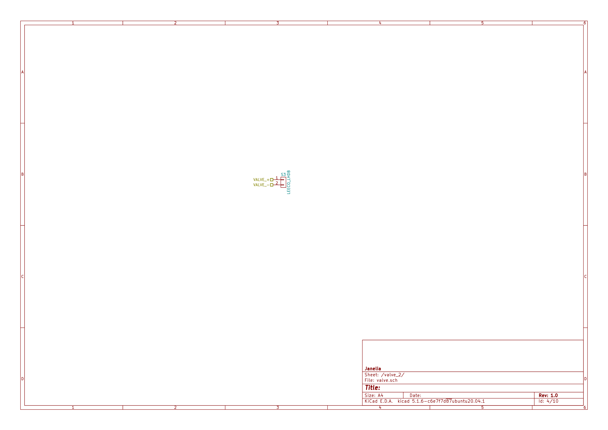
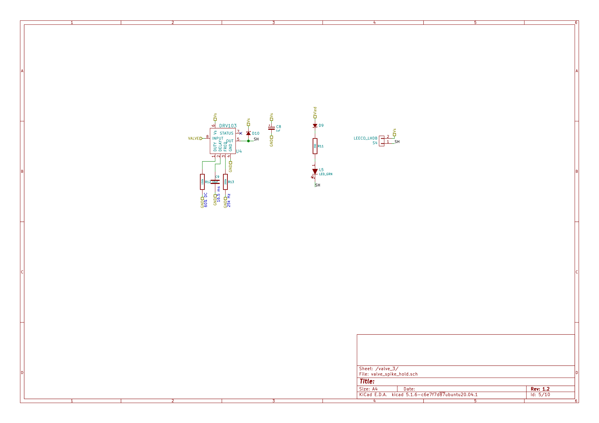
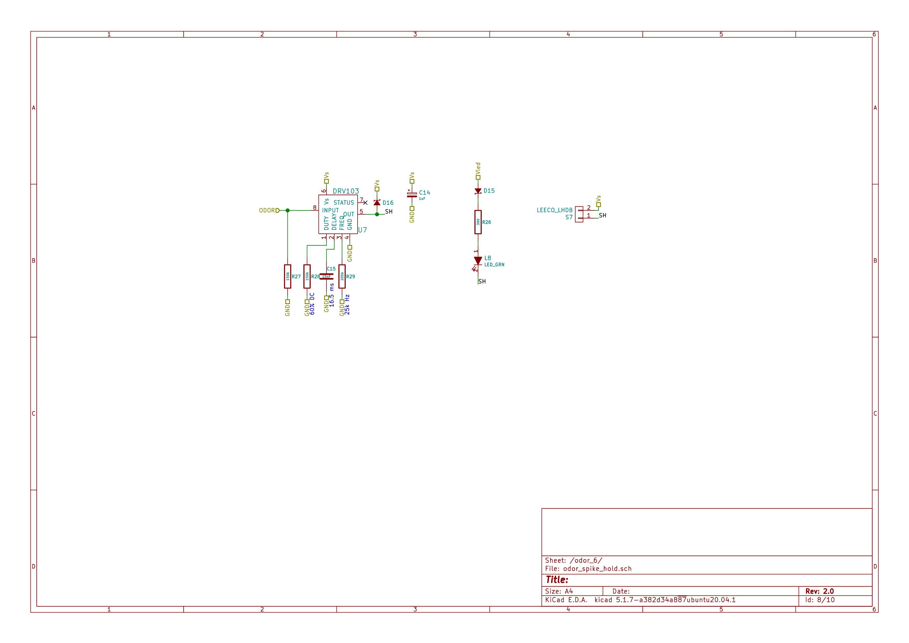
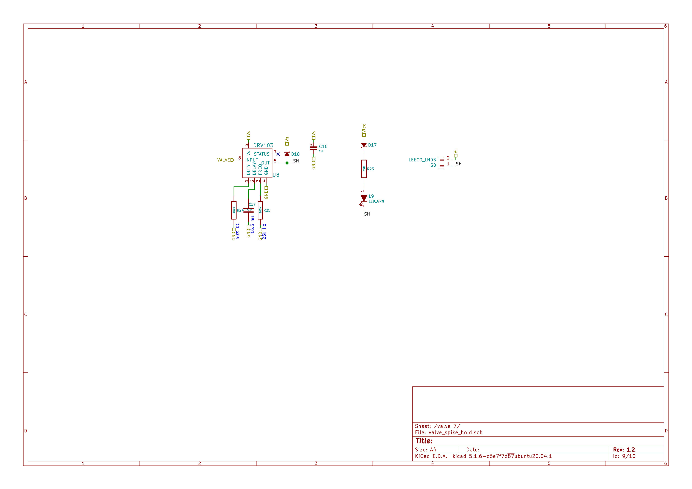
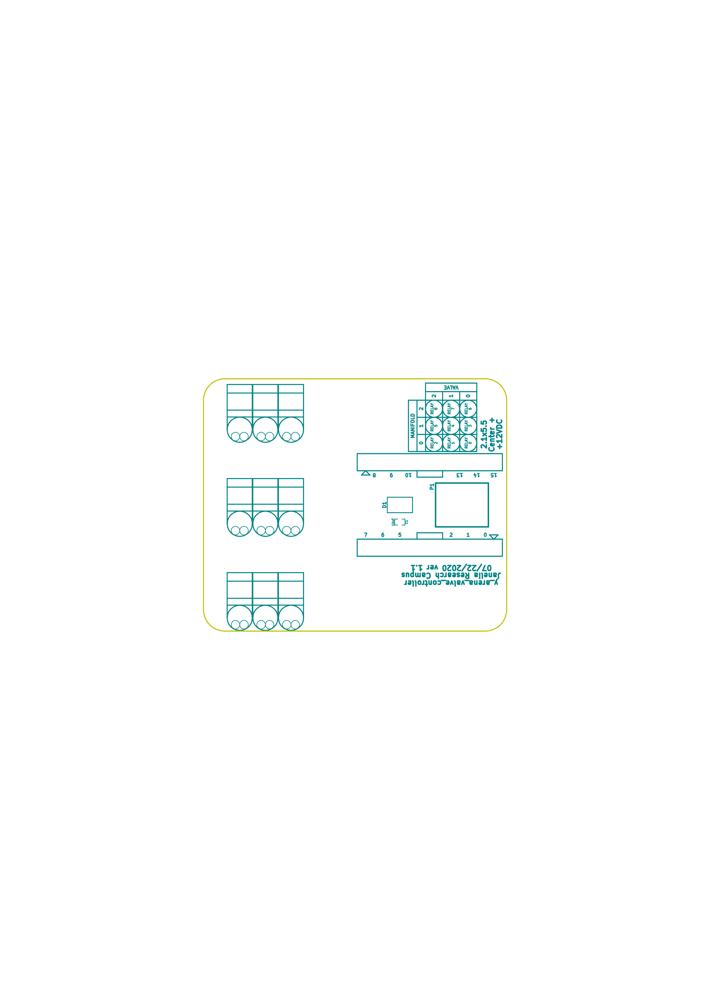
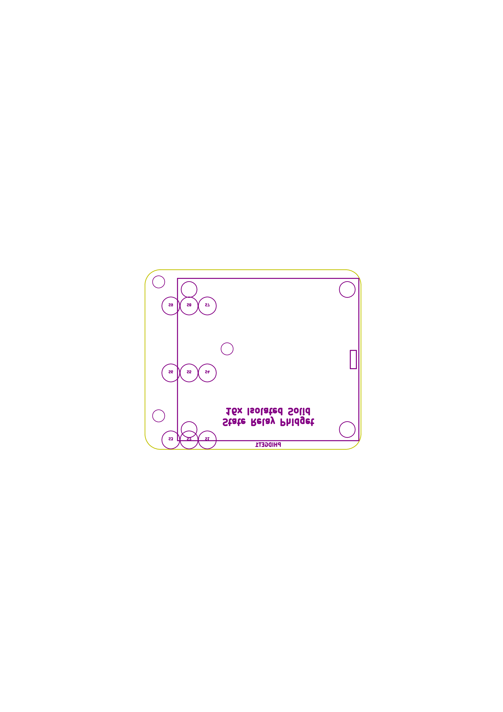

- [Repository Information](#orgbc42dec)
  - [Description](#org338aae6)
- [Images](#org1c6e4e9)
- [Schematic](#org64a1392)
- [Gerbers](#orge607dd2)
- [Bill of Materials](#orgba0b968)
  - [PCB Parts](#org9bbb3bc)
  - [Supplemental Parts](#org647ec9b)
  - [Vendor Parts Lists](#org22c38dd)
- [Supplemental Documentation](#orge913f34)
  - [Assembly Instructions](#org8df99ae)
- [Manufacturing Archive](#orge21427f)

# Repository Information

-   **Name:** y\_arena\_valve\_controller
-   **Version:** 1.1
-   **License:** Open-Source Hardware
-   **URL:** <https://github.com/janelia-kicad/y_arena_valve_controller>
-   **Author:** Peter Polidoro
-   **Email:** peterpolidoro@gmail.com

## Description

This board controls the y-arena valves for the Turner lab.

# Images

# Schematic

[./schematic/y\_arena\_valve\_controller.pdf](./schematic/y_arena_valve_controller.pdf)

# Gerbers

# Bill of Materials

## PCB Parts

| Item | Reference(s)                      | Quantity | Manufacturer                    | Manufacturer Part Number | Vendor   | Vendor Part Number   | Description                    | Package            |
|---- |--------------------------------- |-------- |------------------------------- |------------------------ |-------- |-------------------- |------------------------------ |------------------ |
| 1    | C1                                | 1        | TDK Corporation                 | C2012X5R1V106K085AC      | Digi-Key | 445-14417-1-ND       | CAP CER 10UF 35V X5R           | 0805 (2012 Metric) |
| 2    | C10 C12 C14 C16 C18 C2 C4 C6 C8   | 9        | Vishay Sprague                  | 298D105X0016K2T          | Digi-Key | 718-1618-1-ND        | CAP TANT 1UF 20% 16V           | 0402               |
| 3    | C11 C13 C15 C17 C19 C3 C5 C7 C9   | 9        | Murata Electronics              | GCM155R71H153JA55D       | Digi-Key | 490-16428-1-ND       | CAP CER 0.015UF 50V X7R 0402   | 0402               |
| 4    | D1                                | 1        | Nexperia USA Inc.               | PMEG045V100EPDZ          | Digi-Key | 1727-1904-1-ND       | DIODE SCHOTTKY 45V 10A         | CFP15              |
| 5    | D10 D12 D14 D16 D18 D20 D4 D6 D8  | 9        | Comchip Technology              | CDBQR0230L               | Digi-Key | 641-1275-1-ND        | DIODE SCHOTTKY 30V 200MA       | 0402               |
| 6    | D11 D13 D15 D17 D19 D3 D5 D7 D9   | 9        | Diodes Incorporated             | BAS116LPH4-7B            | Digi-Key | BAS116LPH4-7BDICT-ND | DIODE GEN PURP 85V 215MA 2DFN  | 0402               |
| 7    | D2                                | 1        | Diodes Incorporated             | BAS116LPH4-7B            | Digi-Key | BAS116LPH4-7BDICT-ND | DIODE GEN PURP 85V 215MA 2DFN  | 0402               |
| 8    | L1                                | 1        | Lite-On Inc.                    | LTST-C170GKT             | Digi-Key | 160-1179-1-ND        | LED GREEN CLEAR SMD            | 0805 (2012 Metric) |
| 9    | L10 L2 L3 L4 L5 L6 L7 L8 L9       | 9        | Lite-On Inc.                    | LTST-C170GKT             | Digi-Key | 160-1179-1-ND        | LED GREEN CLEAR SMD            | 0805 (2012 Metric) |
| 10   | P1                                | 1        | CUI Devices                     | PJ-036AH-SMT-TR          | Digi-Key | CP-036AHPJCT-ND      | CONN PWR JACK 2X5.5MM SOLDER   |                    |
| 11   | R1                                | 1        | Panasonic Electronic Components | ERJ-PA2J391X             | Digi-Key | P124568CT-ND         | RES SMD 390 OHM 5% 1/5W        | 0402               |
| 12   | R10 R13 R16 R19 R22 R25 R28 R4 R7 | 9        | Panasonic Electronic Components | ERJ-2RKF2053X            | Digi-Key | P205KLCT-ND          | RES SMD 205K OHM 1% 1/10W 0402 | 0402               |
| 13   | R11 R14 R17 R2 R20 R23 R26 R5 R8  | 9        | Panasonic Electronic Components | ERJ-PA2J391X             | Digi-Key | P124568CT-ND         | RES SMD 390 OHM 5% 1/5W        | 0402               |
| 14   | R12 R15 R18 R21 R24 R27 R3 R6 R9  | 9        | Panasonic Electronic Components | ERJ-2RKF1503X            | Digi-Key | P150KLCT-ND          | RES SMD 150K OHM 1% 1/10W 0402 | 0402               |
| 15   | S1 S2 S3 S4 S5 S6 S7 S8 S9        | 18       | Mill-Max Manufacturing Corp     | 0305-0-15-15-47-27-10-0  | Digi-Key | ED90331-ND           | CONN PIN RCPT .025-.037 SOLDER |                    |
| 16   | SW1                               | 1        | E-Switch                        | 500ASSP1SM6QE            | Digi-Key | EG5810CT-ND          | SWITCH SLIDE SPDT 3A 120V      |                    |
| 17   | TEENSY1                           | 28       | Mill-Max Manufacturing Corp.    | 0305-0-15-15-47-27-10-0  | Digi-Key | ED90331-ND           | CONN PIN RCPT .025-.037 SOLDER |                    |
| 18   | U1 U2 U3 U4 U5 U6 U7 U8 U9        | 9        | Texas Instruments               | DRV103U                  | Digi-Key | 296-11622-ND         | IC LO-SIDE DRIVER PWM 8SOIC    | 8SOIC              |

## Supplemental Parts

| Item | Quantity | Manufacturer                 | Manufacturer Part Number        | Vendor   | Vendor Part Number                 | Description                      |
|---- |-------- |---------------------------- |------------------------------- |-------- |---------------------------------- |-------------------------------- |
| 1    | 1        | SparkFun Electronics         | DEV-15583                       | Digi-Key | 1568-DEV-15583-ND                  | TEENSY 4.0                       |
| 2    | 1        | Qualtek                      | 3021075-03                      | Digi-Key | Q1223-ND                           | USB 2.0 A MALE TO USB 2.0 MICRO  |
| 3    | 1        | Coolgear                     | USBG-4PUSB2-MH                  | Digi-Key | 2671-USBG-4PUSB2-MH-ND             | 4-PORT USB 2.0 MINI METAL HIGH-S |
| 4    | 1        | Tensility International Corp | 10-02739                        | Digi-Key | 839-1474-ND                        | SPLITTER 5.5X2.1MM F TO X4 M     |
| 5    | 1        | Tensility International Corp | CA-2219                         | Digi-Key | CP-2219-ND                         | CABLE ASSY 5.5X2.1MM M/F R/A 3FT |
| 6    | 1        | Raspberry Pi                 | RASPBERRY PI 4B/4GB             | Digi-Key | 1690-RASPBERRYPI4B/4GB-ND          | RASPBERRY PI 4B/4GB              |
| 7    | 1        | Raspberry Pi                 | RPI USB-C POWER SUPPLY BLACK US | Digi-Key | 1690-RPIUSB-CPOWERSUPPLYBLACKUS-ND | RPI USB-C POWER SUPPLY BLACK US  |
| 8    | 1        | Raspberry Pi                 | RASPBERRY PI 4 CASE BLACK/GREY  | Digi-Key | 1690-RASPBERRYPI4CASEBLACK/GREY-ND | RASPBERRY PI 4 CASE BLACK/GREY   |
| 9    | 1        | Raspberry Pi                 | 8997466                         | Digi-Key | 1690-1007-ND                       | RASPBERRY PI 7" TOUCH SCREEN LCD |
| 10   | 1        | ATP Electronics Inc          | AF32GUD3-OEM                    | Digi-Key | AF32GUD3-OEM-ND                    | MEM CARD MICROSD 32GB CLS 10 MLC |
| 11   | 1        | Tripp Lite                   | U352-000-MD                     | Digi-Key | TL825-ND                           | USB 3.0 MULTI-DRIVE SD CF MS     |
| 12   | 1        | Tripp Lite                   | U336-000-R                      | Digi-Key | TL824-ND                           | USB 3.0 TO ETHERNET ADAPTER      |
| 13   | 1        | Assmann WSW Components       | A-MCSSP60010/B                  | Digi-Key | AE10190-ND                         | CABLE MOD 8P8C PLUG-PLUG 3.28FT  |

## Vendor Parts Lists

[./bom/Digi-Key\_parts.csv](./bom/Digi-Key_parts.csv)

[./bom/supplemental\_Digi-Key\_parts.csv](./bom/supplemental_Digi-Key_parts.csv)

# Supplemental Documentation

## Assembly Instructions

-   Solder surface mount and through hole components onto the pcb.

# Manufacturing Archive

Send manufacturing zip file to your favorite PCB manufacturer for fabrication.

[./manufacturing/y\_arena\_valve\_controller\_v1.1.zip](./manufacturing/y_arena_valve_controller_v1.1.zip)
